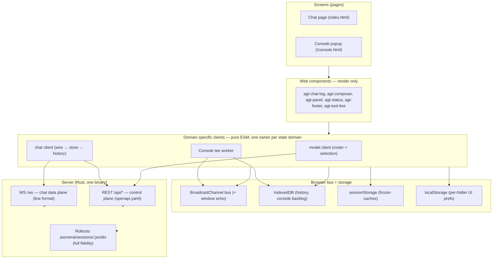
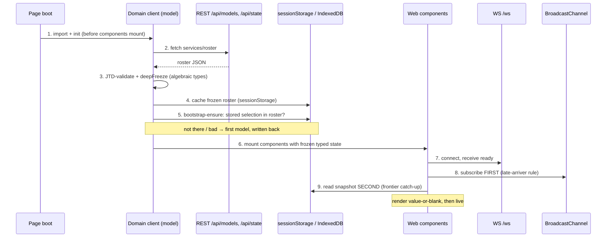
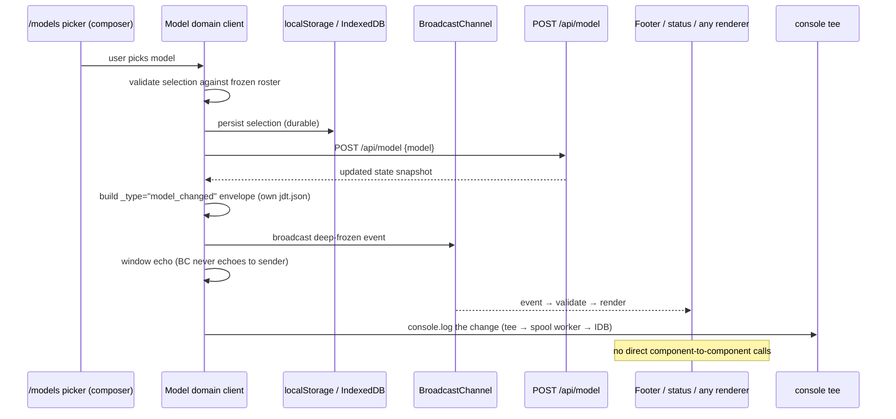
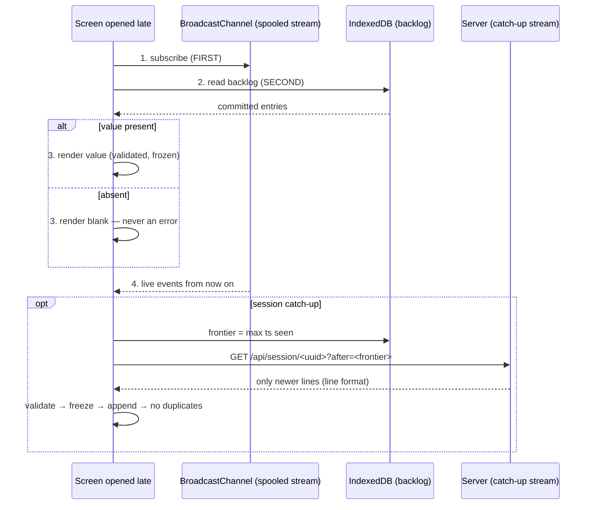

# Frontend Architecture

This is the pedagogical statement of the AxonerAI web frontend: it teaches the
pattern the owner builds with. Every term is defined in
[frontend-glossary.md](frontend-glossary.md); every decision and its history is
in [frontend-decisions-log.md](frontend-decisions-log.md); the working rules are
in [AGENTS.md](../AGENTS.md); the project thesis and review decisions are in
[ARCHITECTURE.md](ARCHITECTURE.md).

## The one pattern

The frontend is **vanilla JS** — plain ES modules with JSDoc annotations checked
by `tsc --noEmit`. No TypeScript syntax, no React, no Babel, no bundler, no
build step. On top of that sit four moves, applied without exception:

1. **Typed data.** Everything crossing an IO boundary (wire, storage,
   BroadcastChannel, worker, fetch) has a `_type` discriminator and its own
   JTD schema; `jtd-codegen` (pinned via mise) generates dependency-free
   validators. Validated values are deep-frozen: immutable algebraic types.
2. **Drop malformed.** Bad data is logged at the boundary and dropped, never
   forwarded. Dispatch is an exhaustive switch on `_type`; it never sees an
   invalid value.
3. **One state owner per domain.** A **domain specific client** — a non-UI
   pure-ESM module — owns that domain's state: it validates on load and save,
   owns the storage reads/writes, and runs at page load **before** any web
   component mounts. Components render only. They never own state and never
   call each other.
4. **Events, not spaghetti.** State changes are broadcast as frozen, validated
   events; any UI that wants to render them subscribes, validates, and
   renders. A late arriver subscribes first, reads storage second, then
   renders the value or a blank — never an error.

The **model** (which provider/model the agent runs) is the worked example of
this pattern. The pattern generalises: each future state domain gets its own
domain specific client, and each future frontend is a **separate screen** (the
devtools console popup already is one) with its own clients composed over the
same bus, storage and backends. The models are never mixed across providers —
model identity travels with the event and the swap is an explicit act.

## (a) Layers

The layering rule is one-way: pages compose components; components accept
typed state from domain clients; domain clients own state and IO; the bus and
storage sit under the clients; the server sits under everything. A component
never reaches across a layer.

## (b) Page-load sequence — client init BEFORE component mounting

Two orderings are load-bearing and both precede rendering:

- The **domain client** initialises before components mount, so components
  mount into an already-consistent, frozen world.
- Each consumer **subscribes before it reads**, so the live stream and the
  storage snapshot are gap-free (commit before the read → in the snapshot;
  after → in the live stream; the overlap → dedupe by id, a cheap belt).

The whole load chain is JTD-validated: server responses → generated validator
→ deep-frozen → typed state → render. Bad responses are logged and dropped at
the boundary.

## (c) `model_changed` — the canonical UI event (with console tee)

There is exactly one event by which any UI surface learns the selected model:
`model_changed`, UI-private, with its own JTD schema, deep-frozen and
JSDoc-typed. Panels never call each other; components never own model state.
The console sees everything because the page's own `console` calls are teed
onto the bus — so the swap is visible in the `/console` popup like any other
event, and the tee cannot drift from what actually ran.

If the server-side model changes, the page must be bounced; the sessionStorage
roster cache is cleared with it and rebuilt at boot.

## (d) Late-arriver flow

Late-arriver correctness rests on the ordering rules, not on dedupe: the
worker persists first and re-broadcasts after `tx.oncomplete`; the consumer
subscribes first and reads second. The server catch-up is additive: the
browser already holds its frontier in IndexedDB, so the server stays
stateless — it replays only lines newer than the frontier.

## (e) Storage-ownership table

| Store | Owned by | Holds | Lifetime | Rules |
|---|---|---|---|---|
| Rollout file `.axonerai/sessions/<uuid>.jsonlts` | Server | Full-fidelity session log (`ts\0json`) | Server restart | Append-only; the browser never reads it directly |
| IndexedDB `agt` (events) | Chat domain client | Session history (keyPath `[sessionId, ts]`) + frontier | Durable | Catch-up source; only frozen validated events enter |
| IndexedDB console backlog | Console spool worker | Console envelopes, ring buffer newest 2000 | Durable | Written by the worker only; re-broadcast after `tx.oncomplete` |
| sessionStorage | Model domain client | Frozen model roster cache | Per tab/session | Cleared by page bounce; rebuilt at boot |
| localStorage | Domain clients / panel | Selected model, per-folder MCP toggles, panel collapse | Durable per origin | JTD-validated on load; bootstrap-ensure against the roster |
| Server REST `/api/*` | Server | Control-plane state (model, tools, sessions) | Per server run | The UI reads/writes via REST; config files are external tooling |

Nobody reaches into another owner's store. The console page, for instance,
reads the backlog through the console client, never by opening arbitrary IDB
transactions against the chat store.

## (f) Test strategy tie-in

The architecture and the test policy are two views of the same decision —
see ARCHITECTURE.md Decisions 2–3 and AGENTS.md for the verbatim rule.

- **Test pure logic with `bun test` (node:test-format sources).** Wire
  validation/freeze/drop, dispatch,
  store, history helpers, models roster, format helpers — all run as plain ES
  modules in bun. A browser is only required when something renders.
- **Per-page single-page suites.** Each screen has an injection-style headless
  suite (`web/test/<page>.headless.mjs` + runner): stub the transport, inject
  frozen records, assert the render. No cross-page orchestration.
- **Never test across a decoupling boundary.** BroadcastChannel, worker and
  IndexedDB boundaries exist so each side can be tested alone. The forbidden
  two-page choreography ("poison tests") is deleted, not debugged.
- **Assembled behaviour is verified by a human** picking at the screen in
  Chrome in real time — real events are spaced out by LLM and human latency,
  which no synthetic zero-delay harness can simulate.
- **Corrupt/missing-data tests are unnecessary** by construction: the type
  system (tsc + JSDoc) plus runtime boundary validation already eliminate
  that class; bad data is logged and dropped at the boundary.
- **Contract triangulation:** the JTD schema, the generated validator and a
  JSDoc-typed sample must agree — drift is caught by tsc, the validator test,
  or the runtime drop, respectively.

The payoff the policy buys: a small test suite that stays small, because the
architecture — validated frozen boundaries, one owner per domain, ordered
bus/storage rules — removes whole classes of defects before any test runs.
